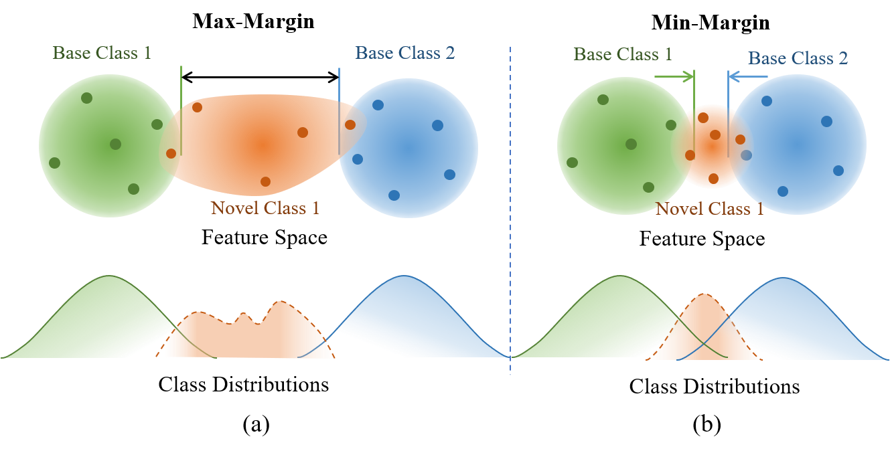
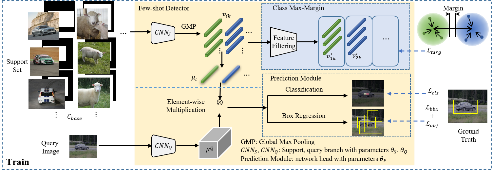
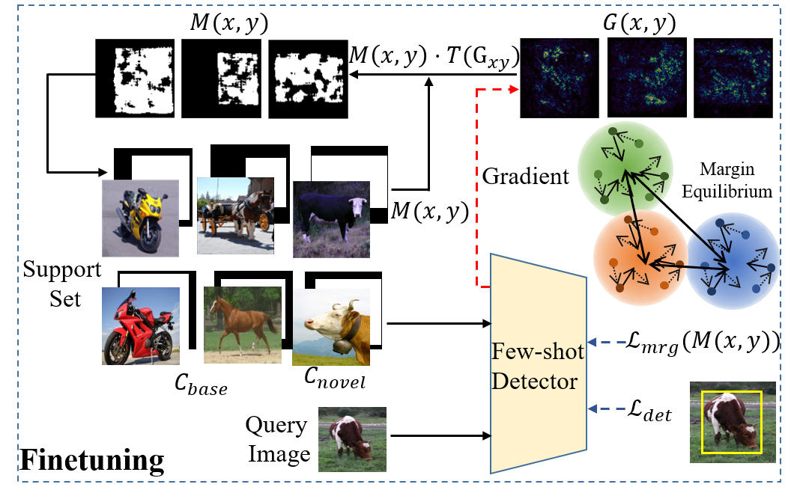

# Beyond Max-Margin: Class Margin Equilibrium for Few-shot Object Detection

This repository is built upon [Meta YOLO](https://github.com/bingykang/Fewshot_Detection).
Second version [CDE](https://github.com/Bohao-Lee/CDE) will coming soon.

# Introduction
This is the officical code of [Beyond Max-Margin: Class Margin Equilibrium for Few-shot Object Detection](https://arxiv.org/pdf/2103.04612.pdf).

Few-shot object detection has made substantial progress by representing novel class objects using the feature representation learned upon a set of base class objects.
However, an implicit contradiction between novel class classification and representation is unfortunately ignored. 
On the one hand, to achieve accurate novel class classification, the distributions of either two base classes must be far away from each other (max-margin). 
On the other hand, to precisely represent novel classes, the distributions of base classes should be close to each other to reduce the intra-class distance of novel classes (min-margin). 
In this paper, we propose a class margin equilibrium (CME) approach, with the aim to optimize both feature space partition and novel class reconstruction in a systematic way. 
CME first converts the few-shot detection problem to the few-shot classification problem by using a fully connected layer to decouple localization features. 
CME then reserves adequate margin space for novel classes by introducing simple-yet-effective class margin loss during feature learning. 
Finally, CME pursues margin equilibrium by disturbing the features of novel class instances in an adversarial min-max fashion. 
Experiments on Pascal VOC and MS-COCO datasets show that CME significantly improves upon two baseline detectors (up to 3 ~ 5% in average), achieving state-of-the-art performance.

The contradiction of represetation and classification in few-shot object detection is shown as following:



In this work, we propose a class margin equilibrium(CME) approach, with the aim to optimize feature space partition for few-shot object detection with adversarial class margin regularization.
For the object detection task, CME first introduces a fully connected layer to decouple localization features which could mislead class margins in the feature space.
CME then pursues a margin equilibrium to comprise representation learning and feature reconstruction. 
Specifically, during base training, CME constructs a feature space where the margins between novel classes are maximized by introducing class margin loss.

The framework is shown as following:


 
During network finetuning, CME introduces a feature disturbance module by truncating gradient maps. 
With multiple training iterations, class margins are regularized in an adversarial min-max fashion towards margin equilibrium, which facilities both feature reconstruction and object classification in the same feature space.

The network with feature disturbance is shown as following:




# Getting started 

## Install

Our code is developed with Python 3.6.5, PyTorch 1.1.0 and torchvision 0.3.0:

```
pip install torch==1.1.0 torchvision==0.3.0 -f https://download.pytorch.org/whl/cu100/torch_stable.html
```

## Dataset preparation

### Get the Pascal VOC dataset

```
cd $DATA_ROOT
wget https://pjreddie.com/media/files/VOCtrainval_11-May-2012.tar
wget https://pjreddie.com/media/files/VOCtrainval_06-Nov-2007.tar
wget https://pjreddie.com/media/files/VOCtest_06-Nov-2007.tar
tar xf VOCtrainval_11-May-2012.tar
tar xf VOCtrainval_06-Nov-2007.tar
tar xf VOCtest_06-Nov-2007.tar
```

### Generate labels for VOC

```
wget http://pjreddie.com/media/files/voc_label.py
python voc_label.py
cat 2007_train.txt 2007_val.txt 2012_*.txt > voc_train.txt
```

### Generate per-class Labels for VOC

```
cp $PROJ_ROOT/scripts/voc_label_1c.py $DATA_ROOT
cd $DATA_ROOT
python voc_label_1c.py
```

### Generate few-shot image list

```
cd $PROJ_ROOT
python scripts/convert_fewlist.py 
```

Also you may need to generate new few-shot datasets Change the ''DROOT'' varibale in scripts/gen_fewlist.py to $DATA_ROOT

```
python scripts/gen_fewlist.py
```

## Training and test

### Modify base training cfg file and finetune cfg file

For base training, please modify cfg/fewshot/metayolo_split1.data, cfg/fewshot/metayolo_split2.data and cfg/fewshot/metayolo_split3.data.
For finetune, please modify cfg/fewshot/metatune_{1,2,3,5,10}shot_split{1,2,3}.data.

```
train = $DATA_ROOT/voc_train.txt
valid = $DATA_ROOT/2007_test.txt
```
### Download the pretrained weights

```
wget http://pjreddie.com/media/files/darknet19_448.conv.23
```

### Modify dir

Modify the dir in train_decoupling_disturbance.py and valid_decoupling.py

```
sys.path.append("Your Project dir")
```

### Start training 

To train model and get corresponding results on split1, run:
```
bash train_model.sh
```

If you want to train other split, you only need to change
```
SPLIT=(1)
```
to which split you want to train.

### Get result

If you want to get the result of model, run:
```
python scripts/voc_eval.py results/path/to/comp4_det_test_
```


# Weight Download

You can download the base training weight by [Google Drive](https://drive.google.com/file/d/1-0Q2EqYXXb0dDm1J0e4dgyXeoQAesibU/view?usp=sharing) or [BaiduYun](https://pan.baidu.com/s/1WUrF0-dMyaS3InObBQa5zw ) with code: **CVPR** 

# Citing

```
@InProceedings{Li_2021_CVPR,
  author = {Bohao Li, Boyu Yang, Chang Liu, Feng Liu, Rongrong Ji and Qixiang Ye},
  title = {Beyond Max-Margin: Class Margin Equilibrium for Few-shot Object Detection},
  booktitle = {IEEE/CVF Conference on Computer Vision and Pattern Recognition (CVPR)},
  month = {June},
  year = {2021}
}
```
